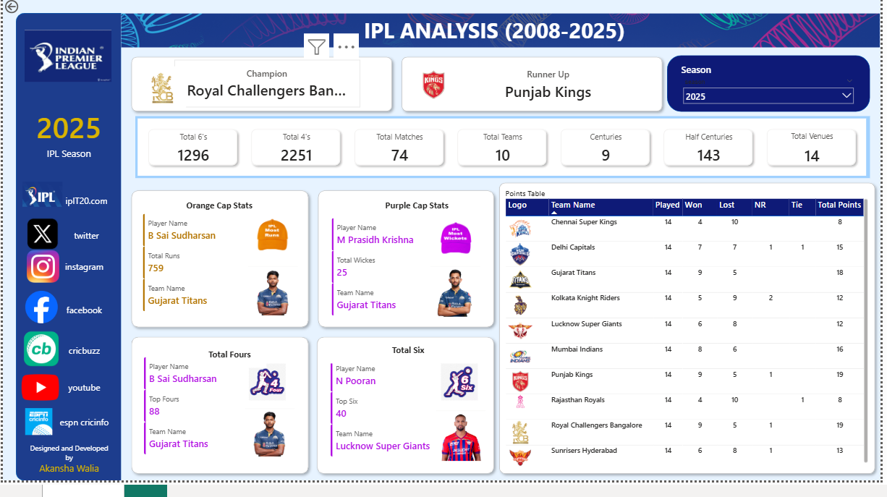

# IPL Analysis Dashboard

## Overview
This project is an interactive Power BI dashboard analyzing IPL data from 2008–2025.

## Objectives
- Analyze team performance
- Compare player statistics
- Identify season trends
- Generate actionable insights

## Tools & Technologies
- Power BI
- Excel
- DAX
- Data Visualization

## Features
- Interactive filters
- Team-wise analysis
- Venue analysis
- Player statistics
- Dynamic KPIs

## Dataset
IPL dataset from 2008–2025.

## Key Insights
- Mumbai Indians has one of the highest win percentages
- Virat Kohli scored highest runs across seasons
- Toss decisions influence match outcomes

## Dashboard Preview

## Author
Akansha Walia
