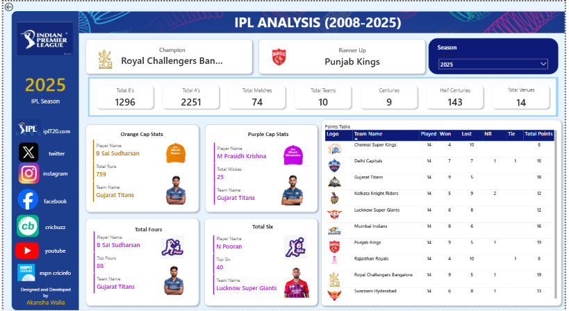

# 🏏 IPL Analysis Dashboard (2008–2025) | Power BI Sports Analytics Project


---

# 📖 Project Overview

The **IPL Analysis Dashboard (2008–2025)** is an interactive Power BI dashboard developed to analyze historical Indian Premier League (IPL) data from **2008 to 2025**. It transforms raw cricket datasets into meaningful insights using interactive visualizations, KPI cards, player statistics, and team performance analysis.

This project demonstrates how Business Intelligence techniques can be applied to sports analytics for data-driven decision-making.

---

# 🎯 Project Objectives

- Analyze IPL statistics from 2008–2025.
- Compare team performances across seasons.
- Identify tournament champions and runner-up teams.
- Analyze Orange Cap and Purple Cap winners.
- Explore batting and bowling achievements.
- Build an interactive sports analytics dashboard.

---

# 🛠️ Tools & Technologies

- Microsoft Power BI
- Microsoft Excel
- Power Query
- DAX (Data Analysis Expressions)
- Data Cleaning
- Data Modeling
- Data Visualization

---

# 📂 Dataset

The project uses three datasets:

- **ipl_matches_data.csv** – Match-level information
- **players-data-updated.csv** – Player statistics
- **teams_data.csv** – Team information

---

# 📈 Dashboard KPIs

- 🏆 Champion Team
- 🥈 Runner-Up Team
- 🏏 Total Sixes
- 🏏 Total Fours
- 📅 Total Matches
- 👥 Total Teams
- 💯 Total Centuries
- 🏅 Total Half Centuries
- 🏟️ Total Venues

---

# 📊 Dashboard Features

- Tournament Summary
- Champion & Runner-Up Analysis
- Season Filter
- Orange Cap Analysis
- Purple Cap Analysis
- Most Fours
- Most Sixes
- Team Points Table
- Interactive KPI Cards
- Dynamic Slicers

---

# 🔍 Key Insights

- Compare team performance across IPL seasons.
- Identify the leading run scorers and wicket takers.
- Analyze batting performance using fours and sixes.
- Track champions and runner-up teams.
- Explore team standings through the points table.
- Filter insights dynamically by season.

---

# ⚡ Challenges Faced

- Cleaning historical IPL datasets.
- Standardizing team names across seasons.
- Creating dynamic DAX measures.
- Designing responsive KPI cards.
- Building an interactive sports analytics dashboard.

---

# 🚀 Future Enhancements

- Head-to-Head Team Comparison
- Venue-wise Performance Analysis
- Toss Decision Analysis
- Win Percentage by Team
- Player Career Statistics
- Match Outcome Prediction using Machine Learning
- Deployment using Power BI Service

---

# 📁 Repository Structure

```text
IPL-Analysis-Dashboard/
│
├── Dashboard/
│   └── IPL_Analysis_Dashboard.pbix
│
├── Datasets/
│   ├── ipl_matches_data.csv
│   ├── players-data-updated.csv
│   └── teams_data.csv
│
├── Images/
│   ├── Dashboard.png
│   ├── Filter Panel.png
│   ├── Orange & Purple Cap Analysis.png
│   └── Points Table.png
│
├── README.md
└── LICENSE
```

---

# 🚀 How to Use

1. Clone this repository.
2. Open the `.pbix` file using Microsoft Power BI Desktop.
3. Explore the interactive dashboard.
4. Select a season using the slicer.
5. Analyze team and player performance.

---

# 📷 Dashboard Preview

## 🏏 Complete Dashboard



---

## 🎛️ Filter Panel


---

## 🟠🟣 Orange & Purple Cap Analysis


---

## 📊 Points Table


---

# 💼 Skills Demonstrated

- Data Cleaning
- Data Modeling
- Data Transformation
- Data Visualization
- Dashboard Design
- Sports Analytics
- DAX Calculations
- KPI Development
- Business Intelligence
- Analytical Thinking

---

# 📌 Project Outcome

This dashboard demonstrates the application of Power BI in sports analytics by transforming historical IPL data into meaningful business insights. Users can analyze tournament performance, compare teams, evaluate player achievements, and explore season-wise trends through interactive visualizations.

---

# 👩‍💻 About Me

**Akansha Walia**

🎓 MCA Student

📊 Aspiring Data Analyst | Data Science & Machine Learning Enthusiast

🔗 **GitHub:** https://github.com/akanshawalia10-eng

🔗 **LinkedIn:** https://www.linkedin.com/in/akansha-walia/

---

# ⭐ Support

If you found this project useful, please consider giving this repository a ⭐.

Thank you for visiting!
